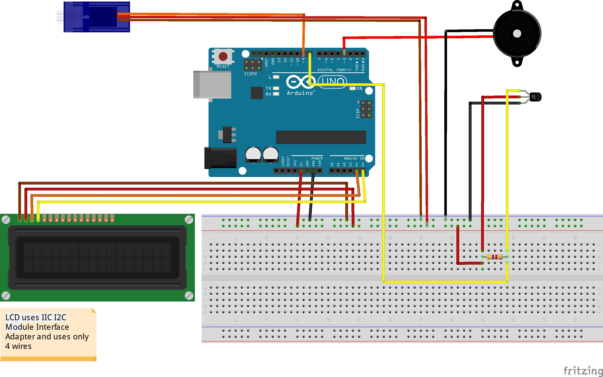

# Warmer or Colder
Used as part of an arduino based puzzle game where contestants must solve a series of challenges to gain access to a locked box. 

## Reqired Libraries
* [Dalas Temperature by Miles Burton](https://www.arduinolibraries.info/libraries/dallas-temperature)
* [OneWire by Paul Stoffregen](https://github.com/PaulStoffregen/OneWire)
* Servo.h
* Wire.h
* LiquidCrystal_I2C
* avr/pgmspace.h

## Parts Used
* DS18B20 Waterproof Temperature Sensors
* SG90 Servo Motor
* Piezo Element
* 16x2 1602 LCD with IIC I2C Module Interface Adapter
* 4.7k Resistor

## Wiring Diagram
